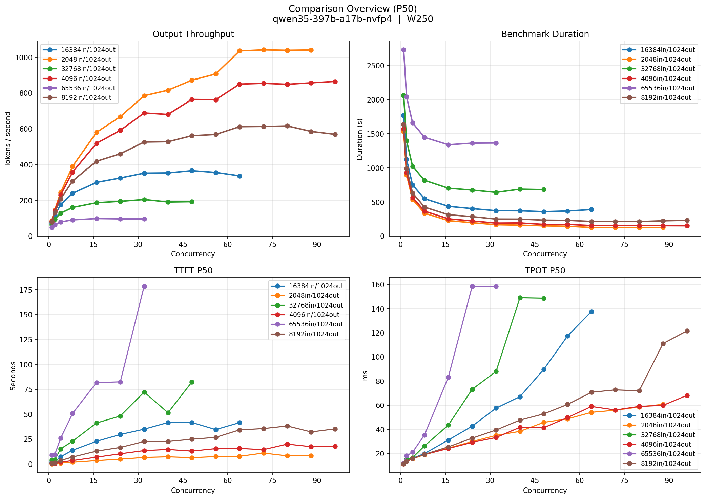
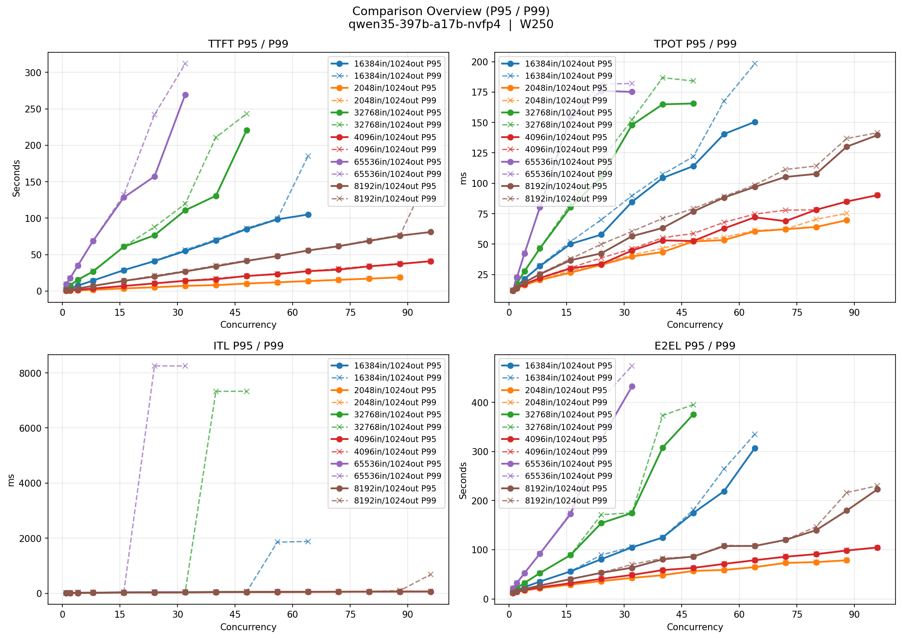
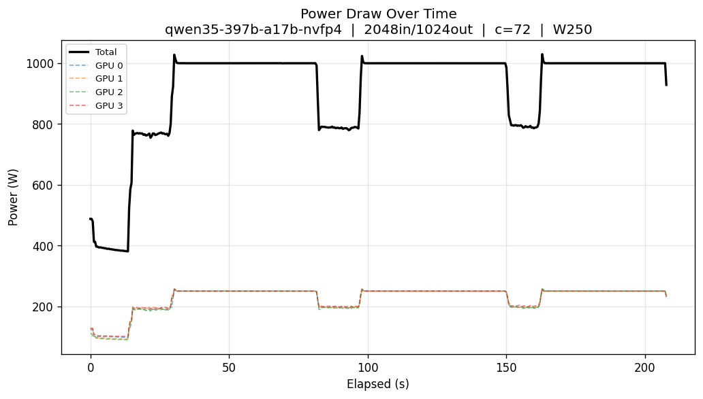
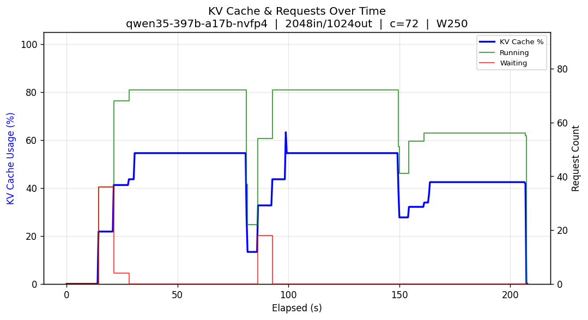

# vllm-bench

Benchmark sweep harness for local coding model inference with vLLM on NVIDIA Blackwell GPUs. Sweeps concurrency levels, input/output token lengths, and collects GPU telemetry (power, KV cache, utilization) to produce comparison charts.

## Hardware

- **GPUs**: 4x NVIDIA RTX 6000 Blackwell Pro Max-Q Workstation Edition (96GB x4)
- **CPU**: AMD Ryzen Threadripper PRO 7985WX (64-core)
- **RAM**: 512 GB DDR5 ECC (8x 64 GB Kingston KSM56R46BD4PMI-64HAI)
- **Platform**: ASUS Pro WS WRX90E-SAGE SE
- **PSU**: Super Flower Leadex Titanium 1700W ATX 3.1
- **OS**: Ubuntu 24.04 LTS
- **Power cap**: 250W per GPU (1000W total)
- **Quantization**: NVFP4 weights, FP8 E4M3 KV cache

## Models Benchmarked

| Model | Architecture | Params (total / active) | Context | vLLM Flags |
|-------|-------------|------------------------|---------|------------|
| **Qwen3.5-397B-A17B** | MoE | 397B / 17B | 131,072 | |
| **MiniMax-M2.5** | MoE | 230B / 10B | 196,608 | |
| **Devstral-2-123B** | Dense | 123B | 262,144 | torch.compile mode 3, CUDAGraphs, fuse_act_quant=false (sm_120) |

All models: `tensor_parallel_size: 4`, `gpu_memory_utilization: 0.90`, `kv_cache_dtype: fp8_e4m3`, `enable_chunked_prefill: true`, `max_num_seqs: 128`, `max_num_batched_tokens: 65536`

## Results Summary

**Test parameters**: 128 random prompts per run, 1024 output tokens, input lengths from 2K to 64K.

### Peak Output Throughput (tok/s)

| Input Length | Qwen3.5-397B MoE | MiniMax-M2.5 | Devstral-2-123B |
|:------------:|:-----------------:|:-----------:|:---------------:|
| 2,048 | 1,041 @c72 | **2,213** @c128 | 1,107 @c64 |
| 4,096 | 865 @c96 | **1,437** @c64 | 1,027 @c64 |
| 8,192 | 616 @c80 | **1,244** @c64 | 894 @c88 |
| 16,384 | **366** @c48 | 408 @c72 | 100 @c64 |
| 32,768 | **205** @c32 | 194 @c48 | 54 @c16 |
| 65,536 | **98** @c16 | 83 @c112 | 25 @c16 |

### Single-User Latency (concurrency=1, 2K input)

| Metric | Qwen3.5-397B MoE | MiniMax-M2.5 | Devstral-2-123B |
|--------|:-----------------:|:-----------:|:---------------:|
| TTFT p50 | 260 ms | **212 ms** | 803 ms |
| TTFT p95 | 264 ms | **216 ms** | 807 ms |
| TTFT p99 | 288 ms | **237 ms** | 808 ms |
| TPOT p50 | **11.5 ms** | 11.9 ms | 33.0 ms |
| TPOT p95 | **11.5 ms** | 11.9 ms | 33.1 ms |
| TPOT p99 | **11.5 ms** | 11.9 ms | 33.1 ms |
| Output throughput (mean) | **85.4 tok/s** | 83.0 tok/s | 29.6 tok/s |
| Output throughput (peak) | **89.0 tok/s** | 86.0 tok/s | 32.0 tok/s |

### Errors

| Model | Failed Requests | Notes |
|-------|:-:|---|
| Qwen3.5-397B | **0** | Clean across all runs |
| MiniMax-M2.5 | 18 | Failures at 65K input with high concurrency (c>=88) |
| Devstral-2-123B | 3 | Failures at 65K input (c=1,2,4) |

## Installation

```bash
uv pip install -e .
```

Requires a running vLLM server (OpenAI-compatible API on `http://127.0.0.1:8000`) and having vllm at path, bench-sweep is relying on `vllm bench`

## Usage

```bash
# Full matrix sweep with telemetry
bench-sweep --matrix --telemetry \
  --model-id qwen35-397b-a17b-nvfp4 \
  --tokenizer /path/to/tokenizer \
  --watt 250 \
  --input-lens 2048,4096,8192,16384,32768,65536 \
  --output-len 1024 \
  --step-size 8 \
  --num-prompts 128

# Per-input-len max concurrency caps (avoid OOM on large inputs)
bench-sweep --matrix --telemetry \
  --model-id qwen35-397b-a17b-nvfp4 \
  --tokenizer /path/to/tokenizer \
  --watt 250 \
  --input-lens 2048,4096,8192,16384,32768,65536 \
  --max-concurrency 128,96,96,96,48,48 \
  --output-len 1024

# Re-plot existing results without re-running benchmarks
bench-sweep --matrix --plot-only \
  --model-id qwen35-397b-a17b-nvfp4 --watt 250 \
  --input-lens 2048,4096,8192,16384,32768,65536 --output-len 1024

# Single concurrency sweep
bench-sweep --model-id qwen35-397b-a17b-nvfp4 \
  --tokenizer /path/to/tokenizer --watt 250

# Dry run (print commands only)
bench-sweep --dry-run --model-id qwen35-397b-a17b-nvfp4 \
  --tokenizer /path/to/tokenizer --watt 250
```

## Directory Structure

```
bench/
  {model}_W{watt}/
    vllm.yaml                          # vLLM server configuration
    b.log                              # bench-sweep invocation command
    bench_sweep.log                    # Full execution log (all runs)

    {model}_random_{in}in_{out}out_c{concurrency}_W{watt}/
      openai-infqps-concurrency{N}-{model}-{YYYYMMDD-HHMMSS}.json
      telemetry.csv
      telemetry_summary.json
      telemetry_power.png
      telemetry_kv_cache.png

    plots/
      {model}_{in}in_{out}out_W{watt}/
        overview.png                   # Combined dashboard
        throughput_vs_concurrency.png
        ttft_vs_concurrency.png
        tpot_vs_concurrency.png
        itl_vs_concurrency.png
        e2el_vs_concurrency.png
        duration_vs_concurrency.png
      {model}_compare_W{watt}/
        compare_overview_p50.png
        compare_overview_p95_p99.png
        compare_throughput_vs_concurrency.png
        compare_ttft_p50_vs_concurrency.png
        compare_tpot_p50_vs_concurrency.png
        compare_itl_p50_vs_concurrency.png
        compare_e2el_p50_vs_concurrency.png
        compare_duration_vs_concurrency.png
        compare_efficiency_vs_concurrency.png   # tok/s per watt
        compare_power_vs_concurrency.png
        compare_gpu_util_vs_concurrency.png
        compare_mem_bw_util_vs_concurrency.png
        compare_kv_cache_vs_concurrency.png
```

## Data Schemas

### Benchmark Results JSON (`openai-infqps-*.json`)

One file per (model, input_len, output_len, concurrency) run. Produced by vLLM's [`benchmark_serving.py`](https://github.com/vllm-project/vllm/tree/main/benchmarks). See upstream for the full schema.

### GPU Telemetry CSV (`telemetry.csv`)

Time-series GPU metrics sampled at ~2.4 Hz during each benchmark run. 4-GPU system (gpu0 through gpu3), with per-GPU columns repeated.

**Header** (30+ columns):

| Column | Type | Unit | Description |
|--------|------|------|-------------|
| `timestamp` | float | Unix epoch (s) | Absolute timestamp |
| `elapsed_s` | float | seconds | Time since benchmark start |
| `gpu{N}_power_w` | float | Watts | power draw |
| `gpu{N}_mem_used_gb` | float | GB | Memory used |
| `gpu{N}_util_pct` | int | % | Compute utilization (0-100) |
| `gpu{N}_mem_bw_util_pct` | int | % | Memory bandwidth utilization |
| `gpu{N}_temp_c` | int | C | Temperature |
| `gpu{N}_pcie_tx_mb_s` | float | MB/s | PCIe transmit throughput |
| `gpu{N}_pcie_rx_mb_s` | float | MB/s | PCIe receive throughput |
| `kv_cache_pct` | float | % | KV cache utilization (from vLLM /metrics) |
| `requests_running` | int | count | Active inference requests |
| `requests_waiting` | int | count | Queued requests |

Where `{N}` is 0, 1, 2, 3. Columns repeat for each GPU.

**Example row** (abbreviated):
```
1774517244.043,0.000,128.0,81.59,0,0,84,0.5,0.4,111.4,81.63,...,0.0,0,0
```

### Telemetry Summary (`telemetry_summary.json`)

Pre-aggregated statistics from `telemetry.csv` per run (power, GPU util, KV cache, PCIe, etc.). Each per-run directory contains one.

Example plots from Qwen3.5-397B-A17B:

| | |
|---|---|
|  |  |
|  |  |

<sub>Bottom row: power draw and KV cache at peak throughput (1,041 tok/s @ concurrency 72, 2048in/1024out)</sub>

### vLLM Configs (`vllm.yaml`)

Per-model configs and checkpoint sources:

- [Qwen3.5-397B-A17B](bench/qwen35-397b-nvfp4_W250/vllm.yaml) — checkpoint: [nvidia/Qwen3.5-397B-A17B-NVFP4](https://huggingface.co/nvidia/Qwen3.5-397B-A17B-NVFP4)
- [MiniMax-M2.5](bench/minimax_m25-nvfp4_W250/vllm.yaml) — checkpoint: [lukealonso/MiniMax-M2.5-NVFP4](https://huggingface.co/lukealonso/MiniMax-M2.5-NVFP4)
- [Devstral-2-123B](bench/devstral-2-123b-instruct-2512_W250/vllm.yaml) — checkpoint: [mistralai/Devstral-2-123B-Instruct-2512](https://huggingface.co/mistralai/Devstral-2-123B-Instruct-2512), manually quantized to NVFP4 using [LLM Compressor](https://github.com/vllm-project/llm-compressor) with `transformers` v5 (one-shot calibration on [nvidia/OpenCodeInstruct](https://huggingface.co/datasets/nvidia/OpenCodeInstruct), 128 samples, 8192 seq len) — [quantization script](src/misc/quantize_devstral2_123b_nvfp4.py)

served via:

```bash
PYTORCH_ALLOC_CONF=expandable_segments:True vllm serve /path/to/model --config /path/to/model/vllm.yaml --port 8000 -O3
```

### Log Files

| File | Content |
|------|---------|
| `b.log` | Single-line `bench-sweep` invocation command with all CLI args |
| `bench_sweep.log` | Full concatenated stdout from all benchmark runs (config dumps, progress, result tables) |

# Disclaimer

> This repo (code, README) was predominantly AI-generated using [cc](https://claude.com/claude-code) with opus-4.6.