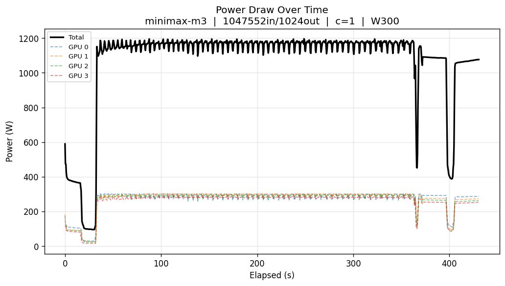

# rtx-pro-6000-bench

Benchmark sweep harness for local model inference (SM120). Sweeps concurrency levels, input/output token lengths, and collects GPU telemetry (power, KV cache, utilization) to produce comparison charts.

## Hardware

- **GPUs**: 4x NVIDIA RTX 6000 Blackwell Pro Max-Q Workstation Edition (96GB x4)
- **CPU**: AMD Ryzen Threadripper PRO 7985WX (64-core)
- **RAM**: 512 GB DDR5 ECC (8x 64 GB Kingston KSM56R46BD4PMI-64HAI)
- **Platform**: ASUS Pro WS WRX90E-SAGE SE
- **PSU**: Super Flower Leadex Titanium 1700W ATX 3.1
- **OS**: Ubuntu 24.04 LTS

## Models Benchmarked

| Model | Released | Architecture | Params (total / active) | Context | Engine | Weights | Quantization | Config | Tput 2K·c64 (tok/s) | Tput 64K·c16 (tok/s) | SWE-bench Verified (mini-swe-agent v2.4.2) | 1M decode (tok/s, c1)¹ | 1M prefill TTFT (c1)¹ | Notes |
|-------|----------|-------------|------------------------|---------|--------|---------|--------------|--------|:------------------:|:-------------------:|:------------------:|:---------------------:|:---------------------:|-------|
| **MiniMax-M3** | Jun 1, 2026 | MoE (GQA + sparse) | 428B / 23B | 1,048,576 | sglang | [olka-fi/MiniMax-M3-MXFP4](https://huggingface.co/olka-fi/MiniMax-M3-MXFP4) | MXFP4 experts + MXFP8 linears | [launch-bwrap-highconc.sh](bench/minimax-m3-mxfp4_W300_TP4_sglang/launch-bwrap-highconc.sh) | 1,045 | 35 | [74.8%](evals/swebench-verified/minimax-m3-2026-06-25/README.md) (374/500) | **39.2** | 7.7 s | native MXFP4 W4A4 experts (clamped SwiGLU-OAI) + MXFP8 weight-only linears + SM120 Triton MSA block-sparse attention; split-K MXFP8; TP4 |
| **DeepSeek-V4-Flash** | Apr 24, 2026 | MoE (MLA + sparse) | 284B / 13B | 1,048,576 | sglang | [deepseek-ai/DeepSeek-V4-Flash](https://huggingface.co/deepseek-ai/DeepSeek-V4-Flash) | MXFP4 experts + FP8 rest (native) | [sglang-single.yaml](bench/deepseek-v4-flash_W300_TP4_sglang/sglang-single.yaml) | 756 | 40 | [76.0%](evals/swebench-verified/deepseek-v4-flash-2026-06-20/README.md) (380/500) | 11.1 | 6.5 s | native MXFP4 W4A4 experts + block-FP8 attention/dense + HMMA tensor-core sparse decode **and** prefill + split-KV long-context indexer (sm_120); TP4 |
| **Qwen3.5-397B-A17B** | Feb 16, 2026 | MoE | 397B / 17B | 262,144 | vLLM | [nvidia/Qwen3.5-397B-A17B-NVFP4](https://huggingface.co/nvidia/Qwen3.5-397B-A17B-NVFP4) | NVFP4 | [vllm.yaml](bench/qwen35-397b-a17b-nvfp4_W300_TP4_vllm/vllm.yaml) | 1,124 | 102 | — | — | — | |

Models above are at **300 W, TP4**, `devstral-2` and `minimax-m2.5` at diff w, tp are excluded, but you can find their results under [bench](bench/)

<sub>¹ Single-stream (c1) decode tok/s / prefill TTFT at 1047552-token input (= 1048576 − 1024).</sub>

## Results Summary

**bench**: 128 random prompts per run, 1024 output tokens, input lengths from 2K to 64K.

### DeepSeek-V4-Flash vs MiniMax-M3 (W300 / TP4, sglang, native MXFP4 W4A4)

#### Output throughput + power at matched concurrency (W300)

One row per model × input length, at the **highest concurrency run on both** for that input. **mem-BW** = mean
memory-bandwidth util; **PCIe** = mean aggregate PCIE tx/rx across 4 GPUs; **GPU0–3** = mean per-GPU temp @ power draw; **sys W** = system power mean/peak.

| Model | Input | Conc | tok/s | mem-BW | PCIe tx/rx | GPU0 | GPU1 | GPU2 | GPU3 | sys W (mean/peak) |
|-------|------:|:----:|:-----:|:------:|:----------:|:----:|:----:|:----:|:----:|:-----------------:|
| **DSV4** | 2,048 | c80 | 697 | 30% | 33/41 GB/s | 89°/240W | 82°/251W | 87°/249W | 85°/262W | 1,003 / 1,099 |
| **DSV4** | 4,096 | c48 | 435 | 29% | 32/41 GB/s | 88°/238W | 83°/250W | 87°/247W | 85°/260W | 994 / 1,166 |
| **DSV4** | 8,192 | c56 | 248 | 27% | 33/43 GB/s | 89°/234W | 84°/247W | 87°/243W | 85°/255W | 979 / 1,173 |
| **DSV4** | 16,384 | c48 | 149 | 24% | 35/47 GB/s | 88°/225W | 82°/237W | 87°/234W | 85°/246W | 942 / 1,155 |
| **DSV4** | 32,768 | c32 | 77 | 22% | 34/44 GB/s | 87°/219W | 79°/228W | 86°/228W | 82°/237W | 913 / 1,009 |
| **DSV4** | 65,536 | c24 | 39 | 19% | 34/45 GB/s | 88°/221W | 81°/232W | 86°/231W | 84°/242W | 926 / 1,054 |
| **M3** | 2,048 | c80 | **1,076** | 50% | 19/18 GB/s | 89°/284W | 85°/280W | 89°/275W | 86°/265W | 1,104 / 1,184 |
| **M3** | 4,096 | c48 | 382 | 50% | 29/27 GB/s | 90°/291W | 85°/285W | 89°/279W | 86°/269W | 1,124 / 1,191 |
| **M3** | 8,192 | c56 | 237 | 49% | 29/27 GB/s | 91°/289W | 86°/286W | 89°/279W | 86°/269W | 1,123 / 1,189 |
| **M3** | 16,384 | c48 | 129 | 47% | 30/26 GB/s | 91°/286W | 86°/283W | 89°/277W | 86°/267W | 1,113 / 1,201 |
| **M3** | 32,768 | c32 | 68 | 44% | 30/25 GB/s | 90°/290W | 85°/285W | 89°/277W | 86°/267W | 1,119 / 1,201 |
| **M3** | 65,536 | c24 | 35 | 43% | 29/24 GB/s | 91°/282W | 86°/282W | 89°/275W | 86°/264W | 1,102 / 1,201 |

<sub>**Throughput** — M3 wins only at 2K (1,076 vs 697); from 4K up DSV4 leads. **mem-BW** — M3 runs
at **~2× DSV4's mem-bandwidth util** at every length (8K: 49% vs 27%): its dense MXFP8 linears are BW-bound, which
draws the ~150–200 W more per run. **PCIe** — DSV4 moves more interconnect traffic (33/41 vs 19/18 GB/s at 2K;
peaks ~100/131), its MLA all-to-all vs M3's lighter block-sparse collective. **Per-GPU thermals** show a stable
**~7 °C chassis gradient** (slots 0/2 hottest, slot 1 coolest) due to 4 GPUs being stacked tight with GPU0/GPU2 being sandwitched in the middle. VRAM is constant at 344 GB (DSV4, `mem-fraction 0.90`) / 317 GB (M3,
`0.95`). SM/memory **clock rates weren't sampled** by the harness, so they're not shown.</sub>

| | |
|---|---|
|  |  |

<sub>Output throughput vs concurrency across input lengths — DeepSeek-V4-Flash (left) and MiniMax-M3 (right).
M3's short-context curves keep rising past the shared ceiling (2K peak 1,593 @c128); DSV4 saturates KV earlier.</sub>

#### Long-context scaling to 1M (single stream, c1)

Single-stream, input 32K → **1,047,552** (= 1M − 1024, one prompt per length, output 1024) — both at full 1M
context on the same 300 W box, so the comparison is power-controlled and the difference is purely architectural
(M3 GQA block-sparse vs DSV4 MLA). DSV4 = its **best** long-ctx config (split-KV indexer,
`SGLANG_SM120_INDEXER_SPLIT`); M3 at `mem-fraction-static 0.95` (fp8 KV pool holds 1,069,580 tokens; the 1M run
holds 370 GB VRAM, KV 98%):

| Input | M3 TTFT | **M3 decode tok/s** | DSV4 TTFT | DSV4 decode tok/s | M3/DSV4 decode |
|------:|:-------:|:-------------------:|:---------:|:-----------------:|:-------:|
| 32,768 | 0.4 s | **72.6** | 0.31 s | 52.9 | 1.4× |
| 131,072 | 0.9 s | **65.8** | 0.79 s | 38.7 | 1.7× |
| 262,144 | 1.9 s | **59.3** | 1.58 s | 28.6 | 2.1× |
| 524,288 | 4.2 s | **50.1** | 3.26 s | 18.7 | 2.7× |
| **~1.04M** | **7.7 s** | **39.2** | **6.46 s** | **11.1** | **3.5×** |

<sub>Decode = steady-state 1000/TPOT (both models). **M3 decode degrades only −46 % over a 32× context increase
(72.6 → 39.2 tok/s); DSV4 drops −79 % even with its split-KV indexer (52.9 → 11.1).** The gap widens with length
(1.4× at 32K → 3.5× at 1M): M3's block-sparse decode scans only the top-16 KV blocks, its indexer auto-shards
across up to 256 CTAs at c1, fp8 KV keeps KV bandwidth low, and split-K keeps the MXFP8 linears off the critical
path. DSV4's decode is sparse-attention top-k too (TPOT ~17 ms single-user), but its 32K/64K KV saturates at
100 %, so its concurrent peak comes earlier. M3 prefill sustains ~130 k tok/s across all lengths (see deploy
doc) — the 1M prompt is processed in 7.7 s.</sub>

| | |
|---|---|
|  |  |

<sub>1,047,552-token long sequence run, 300 W cap per GPU. **DSV4** 900 W mean / 1,055 W peak; **M3** 1,083 W /
1,196 W — M3 sustains ~183 W more, while decoding ~39 vs ~10 tok/s.</sub>

## Installation

```bash
uv pip install -e .
```

Requires a running inference server (OpenAI-compatible API on `http://127.0.0.1:8000`) and `vllm`
installed in the harness venv — `bench-sweep` drives `vllm bench serve --backend openai`, which works
against any OpenAI-compatible endpoint (vLLM **or** sglang). It invokes the bench tool as
`python -m vllm.entrypoints.cli.main bench serve` (so a stale `vllm` console script doesn't block
runs); override with `--bench-cmd` if needed.

### sglang (DeepSeek-V4-Flash)

DeepSeek-V4-Flash is served by our sglang fork (MXFP4 W4A4 + HMMA sparse decode on sm_120). Full
setup: [docs/DEPLOY-MXFP4-W4A4-DEEPSEEK-V4-FLASH-SM120.md](docs/DEPLOY-MXFP4-W4A4-DEEPSEEK-V4-FLASH-SM120.md).
Launch the server, then sweep with `--tokenizer` pointed at the checkpoint:

```bash
# 1. Start the server (config + env in bench/deepseek-v4-flash_W300_TP4_sglang/)
bash bench/deepseek-v4-flash_W300_TP4_sglang/launch.sh   # wait for /v1/models (~2 min)

# 2. Matrix sweep (output 1024, step-size 8 → c1,2,4,8,16,24,…,128; matches the vLLM models)
bench-sweep --matrix --telemetry \
  --model-id deepseek-v4-flash --watt 300 \
  --tokenizer /mnt/hot/ambientlight/models/DeepSeek-V4-Flash \
  --input-lens 2048,4096,8192,16384,32768,65536 --output-len 1024 \
  --step-size 8 --num-prompts 128 --max-error-rate 0.1
```

The sglang server **must** be launched with `enable_metrics: true` (set in `sglang.yaml`) for telemetry
to capture KV-cache % and request counts; GPU power/util work regardless.

## Usage

```bash
# Full matrix sweep with telemetry
bench-sweep --matrix --telemetry \
  --model-id qwen35-397b-a17b-nvfp4 \
  --tokenizer /path/to/tokenizer \
  --watt 250 \
  --input-lens 2048,4096,8192,16384,32768,65536 \
  --output-len 1024 \
  --step-size 8 \
  --num-prompts 128

# Per-input-len max concurrency caps (avoid OOM on large inputs)
bench-sweep --matrix --telemetry \
  --model-id qwen35-397b-a17b-nvfp4 \
  --tokenizer /path/to/tokenizer \
  --watt 250 \
  --input-lens 2048,4096,8192,16384,32768,65536 \
  --max-concurrency 128,96,96,96,48,48 \
  --output-len 1024

# Re-plot existing results without re-running benchmarks
bench-sweep --matrix --plot-only \
  --model-id qwen35-397b-a17b-nvfp4 --watt 250 \
  --input-lens 2048,4096,8192,16384,32768,65536 --output-len 1024

# Single concurrency sweep
bench-sweep --model-id qwen35-397b-a17b-nvfp4 \
  --tokenizer /path/to/tokenizer --watt 250

# Dry run (print commands only)
bench-sweep --dry-run --model-id qwen35-397b-a17b-nvfp4 \
  --tokenizer /path/to/tokenizer --watt 250
```

## Directory Structure

```
bench/
  {model}_W{watt}_TP{tp}_{engine}/
    vllm.yaml | sglang.yaml             # Server configuration
    b.log                                # bench-sweep invocation command
    bench_sweep.log                      # Full execution log (all runs)

    {model}_random_{in}in_{out}out_c{concurrency}_W{watt}/
      openai-infqps-concurrency{N}-{model}-{YYYYMMDD-HHMMSS}.json
      telemetry.csv
      telemetry_summary.json
      telemetry_power.png
      telemetry_kv_cache.png

    plots/
      {model}_{in}in_{out}out_W{watt}/
        overview.png                   # Combined dashboard
        throughput_vs_concurrency.png
        ttft_vs_concurrency.png
        tpot_vs_concurrency.png
        itl_vs_concurrency.png
        e2el_vs_concurrency.png
        duration_vs_concurrency.png
      {model}_compare_W{watt}/
        compare_overview_p50.png
        compare_overview_p95_p99.png
        compare_throughput_vs_concurrency.png
        compare_ttft_p50_vs_concurrency.png
        compare_tpot_p50_vs_concurrency.png
        compare_itl_p50_vs_concurrency.png
        compare_e2el_p50_vs_concurrency.png
        compare_duration_vs_concurrency.png
        compare_efficiency_vs_concurrency.png   # tok/s per watt
        compare_power_vs_concurrency.png
        compare_gpu_util_vs_concurrency.png
        compare_mem_bw_util_vs_concurrency.png
        compare_kv_cache_vs_concurrency.png
```

## Data Schemas

### Benchmark Results JSON (`openai-infqps-*.json`)

One file per (model, input_len, output_len, concurrency) run. Produced by vLLM's [`benchmark_serving.py`](https://github.com/vllm-project/vllm/tree/main/benchmarks). See upstream for the full schema.

### GPU Telemetry CSV (`telemetry.csv`)

Time-series GPU metrics sampled at ~2.4 Hz during each benchmark run. 4-GPU system (gpu0 through gpu3), with per-GPU columns repeated.

**Header** (30+ columns):

| Column | Type | Unit | Description |
|--------|------|------|-------------|
| `timestamp` | float | Unix epoch (s) | Absolute timestamp |
| `elapsed_s` | float | seconds | Time since benchmark start |
| `gpu{N}_power_w` | float | Watts | power draw |
| `gpu{N}_mem_used_gb` | float | GB | Memory used |
| `gpu{N}_util_pct` | int | % | Compute utilization (0-100) |
| `gpu{N}_mem_bw_util_pct` | int | % | Memory bandwidth utilization |
| `gpu{N}_temp_c` | int | C | Temperature |
| `gpu{N}_pcie_tx_mb_s` | float | MB/s | PCIe transmit throughput |
| `gpu{N}_pcie_rx_mb_s` | float | MB/s | PCIe receive throughput |
| `kv_cache_pct` | float | % | KV cache utilization (from server /metrics) |
| `requests_running` | int | count | Active inference requests |
| `requests_waiting` | int | count | Queued requests |

Where `{N}` is 0, 1, 2, 3. Columns repeat for each GPU.

**Example row** (abbreviated):
```
1774517244.043,0.000,128.0,81.59,0,0,84,0.5,0.4,111.4,81.63,...,0.0,0,0
```

### Telemetry Summary (`telemetry_summary.json`)

Pre-aggregated statistics from `telemetry.csv` per run (power, GPU util, KV cache, PCIe, etc.). Each per-run directory contains one.

### Engine Configs

**vLLM models:**

- [Qwen3.5-397B-A17B](bench/qwen35-397b-a17b-nvfp4_W300_TP4_vllm/vllm.yaml) — checkpoint: [nvidia/Qwen3.5-397B-A17B-NVFP4](https://huggingface.co/nvidia/Qwen3.5-397B-A17B-NVFP4)
- [MiniMax-M2.5](bench/minimax_m25-nvfp4_W250_TP4_vllm/vllm.yaml) — checkpoint: [lukealonso/MiniMax-M2.5-NVFP4](https://huggingface.co/lukealonso/MiniMax-M2.5-NVFP4)
- [Devstral-2-123B](bench/devstral-2-123b-instruct-2512_W250_TP4_vllm/vllm.yaml) — checkpoint: [mistralai/Devstral-2-123B-Instruct-2512](https://huggingface.co/mistralai/Devstral-2-123B-Instruct-2512), manually quantized to NVFP4 using [LLM Compressor](https://github.com/vllm-project/llm-compressor) with `transformers` v5 (one-shot calibration on [nvidia/OpenCodeInstruct](https://huggingface.co/datasets/nvidia/OpenCodeInstruct), 128 samples, 8192 seq len) — [quantization script](src/misc/quantize_devstral2_123b_nvfp4.py)

served via:

```bash
PYTORCH_ALLOC_CONF=expandable_segments:True vllm serve /path/to/model --config /path/to/model/vllm.yaml --port 8000 -O3
```

**sglang models:**

- [DeepSeek-V4-Flash](bench/deepseek-v4-flash_W300_TP4_sglang/sglang-single.yaml) — checkpoint: [deepseek-ai/DeepSeek-V4-Flash](https://huggingface.co/deepseek-ai/DeepSeek-V4-Flash) (native MXFP4 W4A4); native MXFP4 fused MoE + HMMA sparse-attention on SM120 via three forks — [setup](docs/DEPLOY-MXFP4-W4A4-DEEPSEEK-V4-FLASH-SM120.md). Served via [`launch-single.sh`](bench/deepseek-v4-flash_W300_TP4_sglang/launch-single.sh).
- [MiniMax-M3](bench/minimax-m3-mxfp4_W300_TP4_sglang/launch-bwrap-highconc.sh) — checkpoint: [olka-fi/MiniMax-M3-MXFP4](https://huggingface.co/olka-fi/MiniMax-M3-MXFP4) (community MXFP4 experts + MXFP8 linears); MXFP4 fused MoE (clamped SwiGLU-OAI) + MXFP8 split-K linears + SM120 Triton MSA block-sparse attention — [setup](docs/DEPLOY-MXFP4-W4A4-MINIMAX-M3-SM120.md). Served via [`launch-bwrap-highconc.sh`](bench/minimax-m3-mxfp4_W300_TP4_sglang/launch-bwrap-highconc.sh).

### Log Files

| File | Content |
|------|---------|
| `b.log` | Single-line `bench-sweep` invocation command with all CLI args |
| `bench_sweep.log` | Full concatenated stdout from all benchmark runs (config dumps, progress, result tables) |
| `sweep-single.log` / `bench_sweep_single.*.log` | Single-sequence (c1) long-context sweep logs — the 32K→1M runs behind the "Long-context scaling to 1M" table (M3: `sweep-single.log`) |

---

# Disclaimer

This repo was mostly AI-generated using [cc](https://claude.com/claude-code) with opus-4.6 and later opus-4.8 (max).
