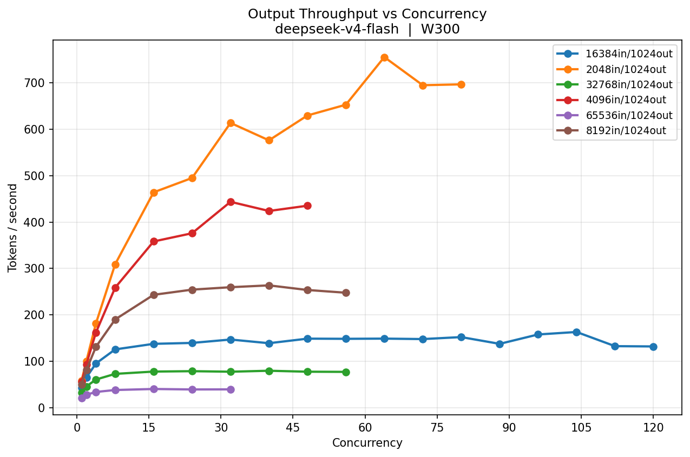
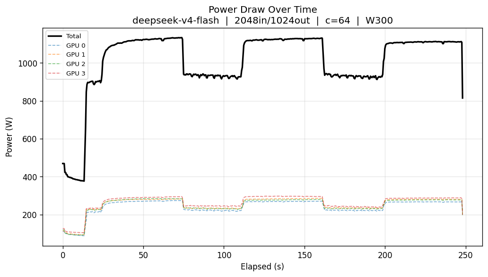
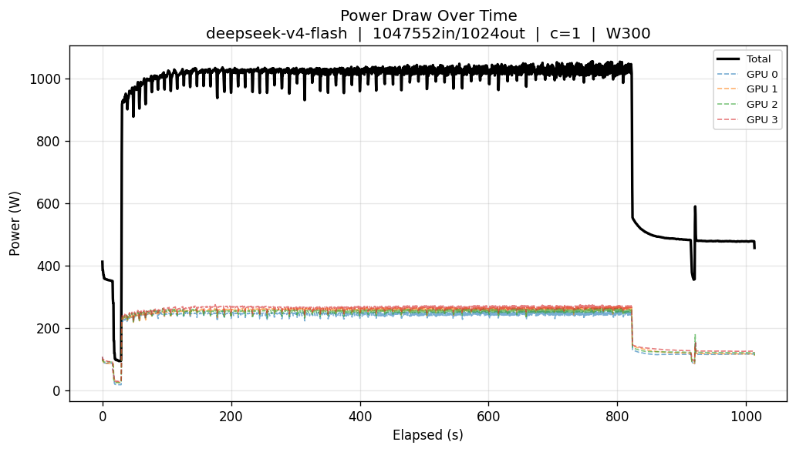
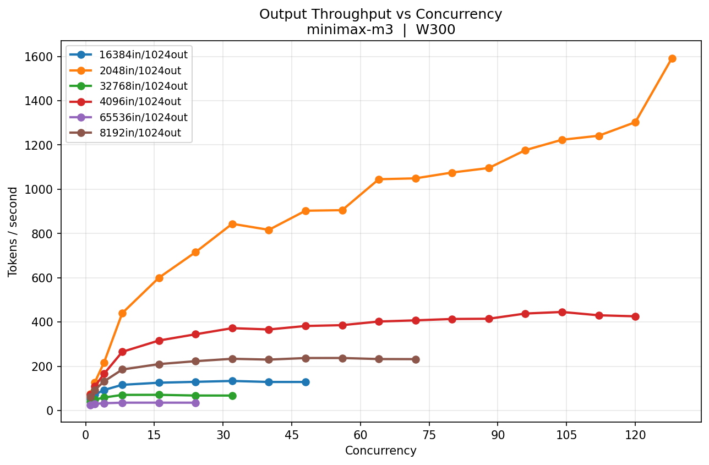
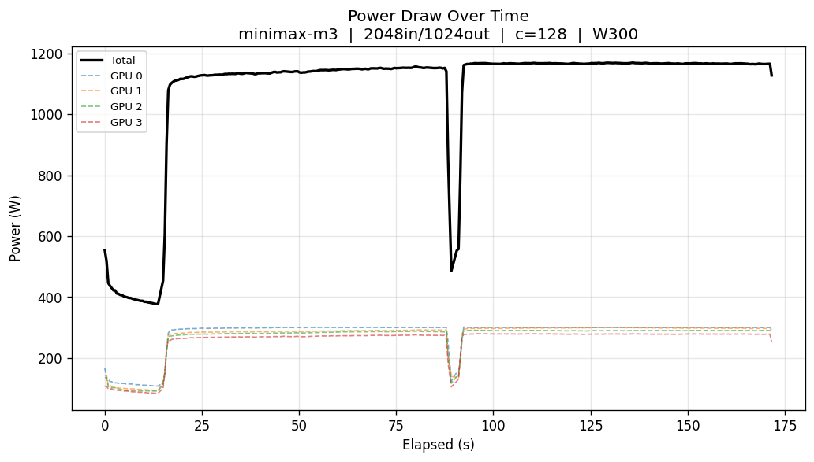
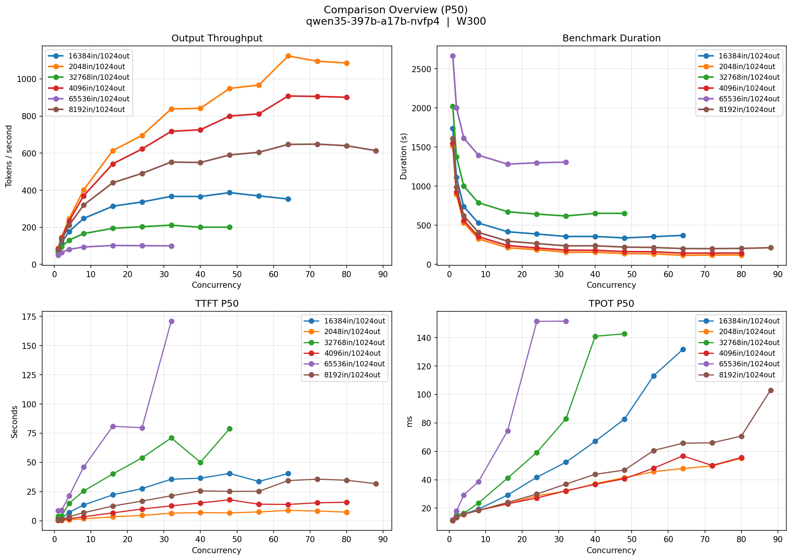
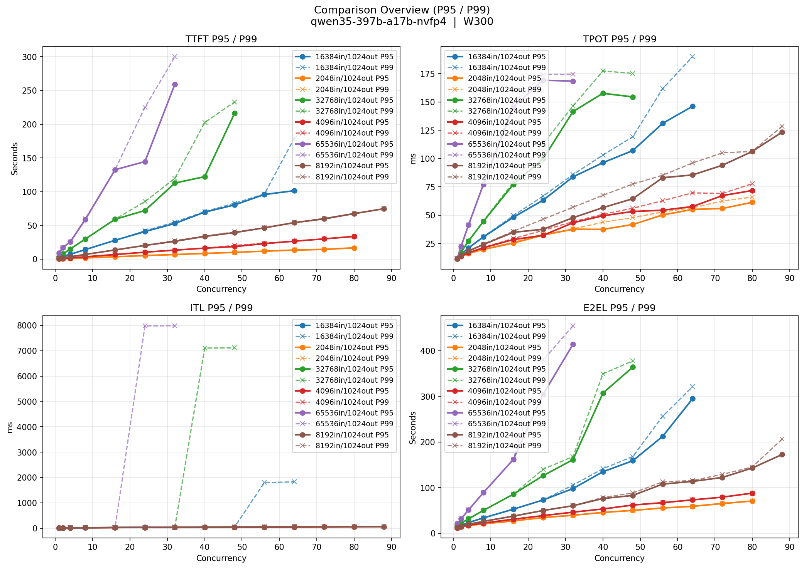
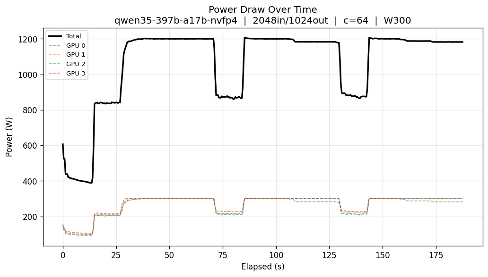
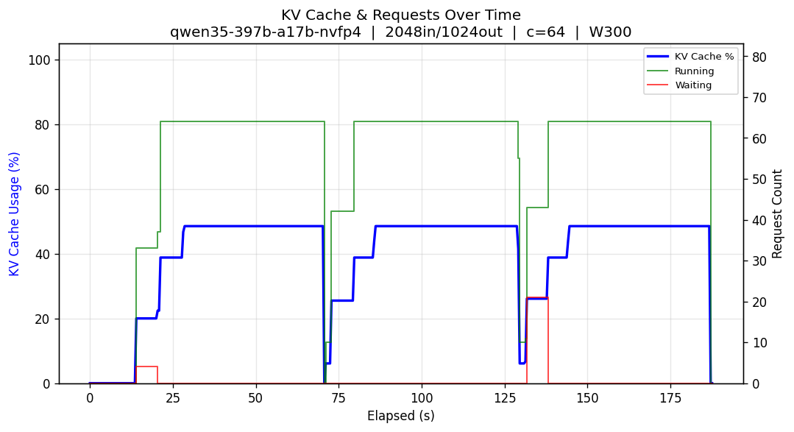

# rtx-pro-6000-bench

Benchmark sweep harness for local model inference (SM120). Sweeps concurrency levels, input/output token lengths, and collects GPU telemetry (power, KV cache, utilization) to produce comparison charts.

## Hardware

- **GPUs**: 4x NVIDIA RTX 6000 Blackwell Pro Max-Q Workstation Edition (96GB x4)
- **CPU**: AMD Ryzen Threadripper PRO 7985WX (64-core)
- **RAM**: 512 GB DDR5 ECC (8x 64 GB Kingston KSM56R46BD4PMI-64HAI)
- **Platform**: ASUS Pro WS WRX90E-SAGE SE
- **PSU**: Super Flower Leadex Titanium 1700W ATX 3.1
- **OS**: Ubuntu 24.04 LTS

## Models Benchmarked

| Model | Released | Architecture | Params (total / active) | Context | Engine | Weights | Quantization | Config | Tput 2K·c64 (tok/s) | Tput 64K·c16 (tok/s) | SWE-bench Verified (mini-swe-agent v2.4.2) | 1M decode (tok/s, c1)¹ | 1M prefill TTFT (c1)¹ | Notes |
|-------|----------|-------------|------------------------|---------|--------|---------|--------------|--------|:------------------:|:-------------------:|:------------------:|:---------------------:|:---------------------:|-------|
| **MiniMax-M3** | Jun 1, 2026 | MoE (GQA + sparse) | 428B / 23B | 1,048,576 | sglang | [olka-fi/MiniMax-M3-MXFP4](https://huggingface.co/olka-fi/MiniMax-M3-MXFP4) | MXFP4 experts + MXFP8 linears | [launch-bwrap-highconc.sh](bench/minimax-m3-mxfp4_W300_TP4_sglang/launch-bwrap-highconc.sh) | 1,045 | 35 | [74.8%](quests/quest5.md) (374/500) | **39.2** | 7.7 s | native MXFP4 W4A4 experts (clamped SwiGLU-OAI) + MXFP8 weight-only linears + SM120 Triton MSA block-sparse attention; split-K MXFP8; TP4 |
| **DeepSeek-V4-Flash** | Apr 24, 2026 | MoE (MLA + sparse) | 284B / 13B | 1,048,576 | sglang | [deepseek-ai/DeepSeek-V4-Flash](https://huggingface.co/deepseek-ai/DeepSeek-V4-Flash) | MXFP4 experts + FP8 rest (native) | [sglang-single.yaml](bench/deepseek-v4-flash_W300_TP4_sglang/sglang-single.yaml) | 756 | 40 | [76.0%](evals/swebench-verified/deepseek-v4-flash-2026-06-20/README.md) (380/500) | 11.1 | 6.5 s | native MXFP4 W4A4 experts + block-FP8 attention/dense + HMMA tensor-core sparse decode **and** prefill + split-KV long-context indexer (sm_120); TP4 |
| **Qwen3.5-397B-A17B** | Feb 16, 2026 | MoE | 397B / 17B | 262,144 | vLLM | [nvidia/Qwen3.5-397B-A17B-NVFP4](https://huggingface.co/nvidia/Qwen3.5-397B-A17B-NVFP4) | NVFP4 | [vllm.yaml](bench/qwen35-397b-a17b-nvfp4_W250_TP4_vllm/vllm.yaml) | 1,036 | 98 | — | — | — | |
| **MiniMax-M2.5** | Feb 12, 2026 | MoE | 230B / 10B | 196,608 | vLLM | [lukealonso/MiniMax-M2.5-NVFP4](https://huggingface.co/lukealonso/MiniMax-M2.5-NVFP4) | NVFP4 | [vllm.yaml](bench/minimax_m25-nvfp4_W250_TP4_vllm/vllm.yaml) | 1,557 | 81 | — | — | — | |
| **Devstral-2-123B** | Dec 9, 2025 | Dense | 123B | 262,144 | vLLM | [mistralai/Devstral-2-123B-Instruct-2512](https://huggingface.co/mistralai/Devstral-2-123B-Instruct-2512) | NVFP4 | [vllm.yaml](bench/devstral-2-123b-instruct-2512_W250_TP4_vllm/vllm.yaml) | 1,107 | 25 | — | — | — | quantized to NVFP4 ([script](src/misc/quantize_devstral2_123b_nvfp4.py)); torch.compile mode 3, CUDAGraphs, fuse_act_quant=false (sm_120) |

Throughput is output tok/s at fixed concurrency (2K input @ c64 · 64K input @ c16); MiniMax-M3 and
DeepSeek-V4-Flash at 300 W, the three vLLM models at 250 W. The vLLM models cap at ≤256K context and were run
throughput-only (no accuracy eval), hence —.

<sub>¹ Single-stream (c1) decode tok/s / prefill TTFT at 1047552-token input (= 1048576 − 1024).</sub>

## Results Summary

**Test parameters**: 128 random prompts per run, 1024 output tokens, input lengths from 2K to 64K.

### W300 / TP4: Qwen3.5-397B vs DeepSeek-V4-Flash vs MiniMax-M3

Three models swept at **300W, TP4** on this box (same `--output-len 1024 --step-size 8` matrix). Qwen3.5-397B-A17B
(NVFP4, vLLM) is a different family/stack, so vs Qwen is "what runs at W300/TP4 here". **DeepSeek-V4-Flash and
MiniMax-M3 are the apples-to-apples pair** — both mixed-precision on the *same sglang stack* (native MXFP4 W4A4
routed experts + 8-bit attention/dense: DSV4 block-FP8, M3 MXFP8), same box, same 300 W cap; the only
differences are architectural (DSV4 MLA + per-token sparse indexer vs M3 GQA block-sparse top-16) and scale
(284B/13B vs 428B/23B).

#### Peak Output Throughput (tok/s)

| Input Length | Qwen3.5-397B-A17B (NVFP4, vLLM) | DeepSeek-V4-Flash (MXFP4, sglang) | MiniMax-M3 (MXFP4, sglang) |
|:------------:|:-------------------------------:|:---------------------------------:|:--------------------------:|
| 2,048 | 1,124 @c64 | 756 @c64 | **1,593** @c128¹ |
| 4,096 | **908** @c64 | 444 @c32 | 445 @c104 |
| 8,192 | **649** @c72 | 263 @c40 | 237 @c56 |
| 16,384 | **387** @c48 | 163 @c104 | 134 @c32 |
| 32,768 | **212** @c32 | 79 @c40 | 71 @c16 |
| 65,536 | **102** @c16 | 40 @c16 | 35 @c16 |

<sub>¹ M3's 2K curve had not saturated at the c128 sweep ceiling (still rising c120→c128), so 1,593 is a floor.
At mid-lengths (8K–64K) DSV4 edges M3 on peak-concurrent throughput — its MLA decode packs a denser batch — but
M3 wins decisively on single-stream and long-context decode (below).</sub>

#### Single-User (concurrency=1, 2K input)

| Metric | Qwen3.5-397B-A17B | DeepSeek-V4-Flash | MiniMax-M3 |
|--------|:-----------------:|:-----------------:|:----------:|
| TTFT p50 | **255 ms** | 604 ms | 815 ms² |
| TPOT p50 | **11.3 ms** | 16.8 ms | 12.9 ms |
| Output throughput | **86.4 tok/s** | 57.6 tok/s | 73.3 tok/s |
| Mean power @ 2K peak | 1,062 W | **1,009 W** | 1,079 W |

<sub>² M3 c1 TTFT here is cold-shape-JIT inflated; warm ≈ 216 ms (W250 sweep). On decode M3 (12.9 ms TPOT,
73 tok/s) clearly beats DSV4 (16.8 ms, 58 tok/s) at 2K — and the gap widens with context (see long-context
section: M3 holds 37.6 tok/s at 1M vs DSV4's 10.4).</sub>

Qwen leads on raw short-context throughput/latency; among the two native-MXFP4 sglang models, DSV4 and M3 trade
places (DSV4 denser at mid-length concurrency, M3 far stronger single-stream and at long context). Per-model
detail below.

### Peak Output Throughput at 250W (tok/s)

| Input Length | Qwen3.5-397B MoE | MiniMax-M2.5 | Devstral-2-123B |
|:------------:|:-----------------:|:-----------:|:---------------:|
| 2,048 | 1,041 @c72 | **2,213** @c128 | 1,107 @c64 |
| 4,096 | 865 @c96 | **1,437** @c64 | 1,027 @c64 |
| 8,192 | 616 @c80 | **1,244** @c64 | 894 @c88 |
| 16,384 | **366** @c48 | 408 @c72 | 100 @c64 |
| 32,768 | **205** @c32 | 194 @c48 | 54 @c16 |
| 65,536 | **98** @c16 | 83 @c112 | 25 @c16 |

### Single-User Latency (concurrency=1, 2K input)

| Metric | Qwen3.5-397B MoE | MiniMax-M2.5 | Devstral-2-123B |
|--------|:-----------------:|:-----------:|:---------------:|
| TTFT p50 | 260 ms | **212 ms** | 803 ms |
| TTFT p95 | 264 ms | **216 ms** | 807 ms |
| TTFT p99 | 288 ms | **237 ms** | 808 ms |
| TPOT p50 | **11.5 ms** | 11.9 ms | 33.0 ms |
| TPOT p95 | **11.5 ms** | 11.9 ms | 33.1 ms |
| TPOT p99 | **11.5 ms** | 11.9 ms | 33.1 ms |
| Output throughput (mean) | **85.4 tok/s** | 83.0 tok/s | 29.6 tok/s |
| Output throughput (peak) | **89.0 tok/s** | 86.0 tok/s | 32.0 tok/s |

### DeepSeek-V4-Flash (W300, sglang, native MXFP4 W4A4 + HMMA sparse attention)

Reported separately: different engine (sglang), quantization (native MXFP4 W4A4 MoE), and power cap (W300).
Full 2K–64K × concurrency sweep, **8576/8576 requests succeeded, 0 failed** — including the >11673-token
prefill batches that crash stock sgl-kernel on SM120 (the gap the HMMA sparse-prefill kernel closes). Setup +
kernel details: [docs/DEPLOY-MXFP4-W4A4-DEEPSEEK-V4-FLASH-SM120.md](docs/DEPLOY-MXFP4-W4A4-DEEPSEEK-V4-FLASH-SM120.md).

Accuracy on this stack: **380/500 = 76.0%** on SWE-bench Verified (thinking + MAX reasoning
effort, mini-swe-agent 2.4 native tool-calling). Config, trajectories, and reproduce guide: [evals/swebench-verified/deepseek-v4-flash-2026-06-20/](evals/swebench-verified/deepseek-v4-flash-2026-06-20/README.md).

#### Peak Output Throughput at 300W (tok/s)

| Input Length | Peak tok/s | @ concurrency | Mean system power |
|:------------:|:----------:|:-------------:|:-----------------:|
| 2,048 | **756** | c64 | 1,009 W |
| 4,096 | **444** | c32 | 1,009 W |
| 8,192 | **263** | c40 | 984 W |
| 16,384 | **163** | c104 | 931 W |
| 32,768 | **79** | c40 | 914 W |
| 65,536 | **40** | c16 | 919 W |

#### Single-User Latency (concurrency=1, by prompt length)

| Input Length | TTFT p50 | TTFT p99 | TPOT p50 | Output tok/s | E2E p50 (s) |
|:------------:|:--------:|:--------:|:--------:|:------------:|:-----------:|
| 2,048 | 604 ms | 819 ms | 16.8 ms | 57.6 | 17.8 |
| 4,096 | 1,285 ms | 1,451 ms | 17.0 ms | 55.0 | 18.6 |
| 8,192 | 2,653 ms | 2,725 ms | 17.5 ms | 49.8 | 20.6 |
| 16,384 | 5,381 ms | 5,428 ms | 18.5 ms | 42.2 | 24.3 |
| 32,768 | 11,199 ms | 11,238 ms | 20.4 ms | 32.0 | 32.1 |
| 65,536 | 23,914 ms | 24,697 ms | 24.2 ms | 21.0 | 48.6 |

TTFT scales with prompt length (prefill cost); TPOT stays ~17–24 ms (decode is sparse-attention top-k, near
prompt-independent), so single-stream output throughput tapers from 58 → 21 tok/s as KV grows.

Per-input-length charts in [bench/deepseek-v4-flash_W300_TP4_sglang/plots/](bench/deepseek-v4-flash_W300_TP4_sglang/plots/);
peak throughput is decode-bound (TPOT ~17 ms single-user), while long-context throughput is gated by the
sparse-attention gather + KV-cache capacity (32K/64K saturate KV at 100%, hence early concurrency peaks).

| | |
|---|---|
|  |  |

<sub>Left: output throughput vs concurrency across input lengths. Right: system power at peak throughput (756 tok/s @ c64, 2048in/1024out) — ~1,009 W mean, 94% GPU util.</sub>

#### Long-context scaling to 1M (single stream, c1)

A separate single-concurrency sweep doubling the prompt 2K → **1,047,552** (= 1M − 1024), one prompt per length, output 1024. Run with
[`sglang-single.yaml`](bench/deepseek-v4-flash_W300_TP4_sglang/sglang-single.yaml)
(full 1M context, `mem-fraction-static 0.80`, `chunked-prefill-size 8192`, `max-running-requests 1`) +
[`launch-single.sh`](bench/deepseek-v4-flash_W300_TP4_sglang/launch-single.sh), which enables the **split-KV
indexer** (`SGLANG_SM120_INDEXER_SPLIT`).

| Input | TTFT (prefill) | TPOT (decode) | Output tok/s | vs no-split | Peak VRAM/GPU | KV |
|------:|:--------------:|:-------------:|:------------:|:-----------:|:-------------:|:--:|
| 2,048 | 0.19 s | 16.7 ms | 59.2 | 1.01× | 85% | 1% |
| 8,192 | 0.20 s | 17.2 ms | 57.6 | 1.02× | 85% | 2% |
| 32,768 | 0.31 s | 18.9 ms | 52.1 | 1.08× | 87% | 7% |
| 131,072 | 0.79 s | 25.8 ms | 37.6 | 1.22× | 87% | 7% |
| 262,144 | 1.58 s | 35.0 ms | 27.4 | 1.32× | 88% | 12% |
| 524,288 | 3.26 s | 53.5 ms | 17.7 | 1.43× | 90% | 23% |
| **1,047,552** | **6.46 s** | **90.2 ms** | **10.4** | **1.51×** | **95%** | **47%** |

| |
|---|
|  |

<sub>System power during the 1,047,552-token single-stream run (split-KV indexer; TTFT 6.5 s prefill, then 1024-token decode at ~10 tok/s; ~900 W mean).</sub>


### MiniMax-M3 (W300, sglang, native MXFP4 W4A4 + MXFP8 linears + sparse attention)

428B / 23B-active MoE with MiniMax Sparse Attention (GQA, block-sparse top-16). Native MXFP4 W4A4 routed
experts (clamped SwiGLU-OAI) + MXFP8 weight-only linears + **fp8 KV cache** + **split-K MXFP8** GEMMs, all on
SM120 Triton MSA attention. Quality: **40/41 = 97.6%** on GSM8K (greedy). Setup + kernel details:
[docs/DEPLOY-MXFP4-W4A4-MINIMAX-M3-SM120.md](docs/DEPLOY-MXFP4-W4A4-MINIMAX-M3-SM120.md).

Full 2K–64K × concurrency sweep at W300: **9,088/9,088 requests succeeded, 0 failed**; a matching W250 sweep
adds another **9,856/9,856, 0 failed** (18,944 requests total, zero failures across both power caps).

#### Peak Output Throughput at 300W (tok/s)

| Input Length | Peak tok/s | @ concurrency | Mean system power |
|:------------:|:----------:|:-------------:|:-----------------:|
| 2,048 | **1,593** | c128 (still climbing) | 1,079 W |
| 4,096 | **445** | c104 | 1,123 W |
| 8,192 | **237** | c56 | 1,123 W |
| 16,384 | **134** | c32 | 1,113 W |
| 32,768 | **71** | c16 | 1,119 W |
| 65,536 | **35** | c16 | 1,104 W |

The 2K curve had not saturated at c128 (the sweep ceiling) — throughput was still rising (1,204 @c120 → 1,593
@c128), so 1,593 is a floor, not a peak. Longer inputs saturate KV early (c16–c56), as expected.

#### Single-User Latency (concurrency=1, by prompt length)

| Input Length | TTFT p50 | TTFT p99 | TPOT p50 | Output tok/s | E2E p50 (s) |
|:------------:|:--------:|:--------:|:--------:|:------------:|:-----------:|
| 2,048 | 815 ms† | 859 ms | 12.9 ms | 73.3 | 14.0 |
| 4,096 | 844 ms | 1,608 ms | 12.9 ms | 71.6 | 14.0 |
| 8,192 | 3,176 ms | 3,201 ms | 13.0 ms | 62.5 | 16.4 |
| 16,384 | 6,362 ms | 6,408 ms | 13.1 ms | 52.0 | 19.7 |
| 32,768 | 12,746 ms | 12,844 ms | 13.3 ms | 38.9 | 26.4 |
| 65,536 | 25,746 ms | 25,907 ms | 13.8 ms | 25.8 | 39.9 |

<sub>† The 2K TTFT includes a one-time cold-shape CuteDSL JIT charged to the first sweep run; warm ≈ 216 ms
(per the W250 sweep). Decode/TPOT are unaffected.</sub>

TPOT holds **12.9 → 13.8 ms across a 32× context increase** (2K → 64K) — M3's block-sparse decode scans only
the top-16 KV blocks, so per-token cost is near context-independent; single-stream throughput tapers 73 → 26
tok/s purely from the growing prefill/KV, not decode. TTFT scales with prompt length (prefill).

| | |
|---|---|
|  |  |

<sub>Left: output throughput vs concurrency across input lengths. Right: system power at peak 2K throughput
(1,593 tok/s @ c128) — ~1,079 W mean, 90.5% GPU util, 46% mem-bandwidth util.</sub>

#### Decode-only throughput vs Marlin baseline (short prompt, by concurrency)

A separate decode-only measurement (short output, no prefill amortization): native MXFP4 W4A4 **batches**
concurrent decode where the Marlin W4A16 baseline (24.6 tok/s c1) **serializes** and collapses past c4:

| concurrency | 1 | 2 | 4 | 16 | 32 |
|:-----------:|:--:|:--:|:--:|:---:|:---:|
| **agg tok/s** | **79** | 131 | 231 | 701 | 975 |

#### Long-context scaling to 1M (single stream, c1)

Single-stream, input 2K → ~1.04M, decode steady-state (full 1M context, `mem-fraction-static 0.95`,
`chunked-prefill-size 8192`; fp8 KV pool holds 1,069,580 tokens; 1M run holds 370 GB VRAM, KV 98%). **Same box,
same 300 W cap** as the DeepSeek-V4-Flash sweep above — so the comparison is power-controlled, and the
difference is architectural (M3 GQA block-sparse vs DSV4 MLA). DSV4 column = its **best** long-ctx config
(split-KV indexer, from the table above):

| Input | M3 TTFT | M3 prefill tok/s | **M3 decode tok/s** | DSV4 decode tok/s | M3/DSV4 |
|------:|:-------:|:----------------:|:-------------------:|:-----------------:|:-------:|
| 2,048 | 0.7 s¹ | — ¹ | **76.4** | 59.8 | 1.3× |
| 32,768 | 0.4 s | 79,300 | **72.6** | 52.9 | 1.4× |
| 131,072 | 0.9 s | 139,800 | **65.8** | 38.7 | 1.7× |
| 262,144 | 1.9 s | 134,900 | **59.3** | 28.6 | 2.1× |
| 524,288 | 4.2 s | 125,700 | **50.1** | 18.7 | 2.7× |
| **~1.04M** | **7.7 s** | **136,800** | **39.2** | 11.1 | **3.5×** |

<sub>¹ 2K is prefill-trivial (TTFT is fixed launch overhead, not compute), so its "prefill tok/s" is not
meaningful. **These are fresh runs on the dynamic-M stack**: the earlier long-context sweep charged a per-chunk
CuteDSL recompile storm to TTFT (1M prefill took **513 s @ ~2,028 tok/s**); compiling the SM120 MoE kernel with
a symbolic token dim (`FLASHINFER_B12X_STATIC_DYNAMIC_M`) collapses that to **7.7 s @ 136,800 tok/s — a 67×
prefill TTFT win** with **decode unchanged** (the fix is purely prefill-side). See [quest5](quests/quest5.md).</sub>

**M3 decode degrades only −49 % over a 512× context increase (76.4 → 39.2 tok/s); DSV4 drops −81 % even with
its split-KV indexer (59.8 → 11.1).** The gap widens with length (1.3× at 2K → 3.5× at 1M): M3's sparse-attention
decode scans only the top-16 KV blocks (cost ~context-independent), its indexer auto-shards across up to 256
CTAs at c1, fp8 KV keeps KV bandwidth low, and split-K keeps the MXFP8 linears off the critical path. The full 1M
single sequence fits at `mem-fraction-static 0.95`, and — post-dynamic-M — prefill sustains ~130 k tok/s all the
way out, so the 1M prompt is fully processed in **7.7 s** rather than 8.5 min.


## Installation

```bash
uv pip install -e .
```

Requires a running inference server (OpenAI-compatible API on `http://127.0.0.1:8000`) and `vllm`
installed in the harness venv — `bench-sweep` drives `vllm bench serve --backend openai`, which works
against any OpenAI-compatible endpoint (vLLM **or** sglang). It invokes the bench tool as
`python -m vllm.entrypoints.cli.main bench serve` (so a stale `vllm` console script doesn't block
runs); override with `--bench-cmd` if needed.

### sglang (DeepSeek-V4-Flash)

DeepSeek-V4-Flash is served by our sglang fork (MXFP4 W4A4 + HMMA sparse decode on sm_120). Full
setup: [docs/DEPLOY-MXFP4-W4A4-DEEPSEEK-V4-FLASH-SM120.md](docs/DEPLOY-MXFP4-W4A4-DEEPSEEK-V4-FLASH-SM120.md).
Launch the server, then sweep with `--tokenizer` pointed at the checkpoint:

```bash
# 1. Start the server (config + env in bench/deepseek-v4-flash_W300_TP4_sglang/)
bash bench/deepseek-v4-flash_W300_TP4_sglang/launch.sh   # wait for /v1/models (~2 min)

# 2. Matrix sweep (output 1024, step-size 8 → c1,2,4,8,16,24,…,128; matches the vLLM models)
bench-sweep --matrix --telemetry \
  --model-id deepseek-v4-flash --watt 300 \
  --tokenizer /mnt/hot/ambientlight/models/DeepSeek-V4-Flash \
  --input-lens 2048,4096,8192,16384,32768,65536 --output-len 1024 \
  --step-size 8 --num-prompts 128 --max-error-rate 0.1
```

The sglang server **must** be launched with `enable_metrics: true` (set in `sglang.yaml`) for telemetry
to capture KV-cache % and request counts; GPU power/util work regardless.

## Usage

```bash
# Full matrix sweep with telemetry
bench-sweep --matrix --telemetry \
  --model-id qwen35-397b-a17b-nvfp4 \
  --tokenizer /path/to/tokenizer \
  --watt 250 \
  --input-lens 2048,4096,8192,16384,32768,65536 \
  --output-len 1024 \
  --step-size 8 \
  --num-prompts 128

# Per-input-len max concurrency caps (avoid OOM on large inputs)
bench-sweep --matrix --telemetry \
  --model-id qwen35-397b-a17b-nvfp4 \
  --tokenizer /path/to/tokenizer \
  --watt 250 \
  --input-lens 2048,4096,8192,16384,32768,65536 \
  --max-concurrency 128,96,96,96,48,48 \
  --output-len 1024

# Re-plot existing results without re-running benchmarks
bench-sweep --matrix --plot-only \
  --model-id qwen35-397b-a17b-nvfp4 --watt 250 \
  --input-lens 2048,4096,8192,16384,32768,65536 --output-len 1024

# Single concurrency sweep
bench-sweep --model-id qwen35-397b-a17b-nvfp4 \
  --tokenizer /path/to/tokenizer --watt 250

# Dry run (print commands only)
bench-sweep --dry-run --model-id qwen35-397b-a17b-nvfp4 \
  --tokenizer /path/to/tokenizer --watt 250
```

## Directory Structure

```
bench/
  {model}_W{watt}_TP{tp}_{engine}/
    vllm.yaml | sglang.yaml             # Server configuration
    b.log                                # bench-sweep invocation command
    bench_sweep.log                      # Full execution log (all runs)

    {model}_random_{in}in_{out}out_c{concurrency}_W{watt}/
      openai-infqps-concurrency{N}-{model}-{YYYYMMDD-HHMMSS}.json
      telemetry.csv
      telemetry_summary.json
      telemetry_power.png
      telemetry_kv_cache.png

    plots/
      {model}_{in}in_{out}out_W{watt}/
        overview.png                   # Combined dashboard
        throughput_vs_concurrency.png
        ttft_vs_concurrency.png
        tpot_vs_concurrency.png
        itl_vs_concurrency.png
        e2el_vs_concurrency.png
        duration_vs_concurrency.png
      {model}_compare_W{watt}/
        compare_overview_p50.png
        compare_overview_p95_p99.png
        compare_throughput_vs_concurrency.png
        compare_ttft_p50_vs_concurrency.png
        compare_tpot_p50_vs_concurrency.png
        compare_itl_p50_vs_concurrency.png
        compare_e2el_p50_vs_concurrency.png
        compare_duration_vs_concurrency.png
        compare_efficiency_vs_concurrency.png   # tok/s per watt
        compare_power_vs_concurrency.png
        compare_gpu_util_vs_concurrency.png
        compare_mem_bw_util_vs_concurrency.png
        compare_kv_cache_vs_concurrency.png
```

## Data Schemas

### Benchmark Results JSON (`openai-infqps-*.json`)

One file per (model, input_len, output_len, concurrency) run. Produced by vLLM's [`benchmark_serving.py`](https://github.com/vllm-project/vllm/tree/main/benchmarks). See upstream for the full schema.

### GPU Telemetry CSV (`telemetry.csv`)

Time-series GPU metrics sampled at ~2.4 Hz during each benchmark run. 4-GPU system (gpu0 through gpu3), with per-GPU columns repeated.

**Header** (30+ columns):

| Column | Type | Unit | Description |
|--------|------|------|-------------|
| `timestamp` | float | Unix epoch (s) | Absolute timestamp |
| `elapsed_s` | float | seconds | Time since benchmark start |
| `gpu{N}_power_w` | float | Watts | power draw |
| `gpu{N}_mem_used_gb` | float | GB | Memory used |
| `gpu{N}_util_pct` | int | % | Compute utilization (0-100) |
| `gpu{N}_mem_bw_util_pct` | int | % | Memory bandwidth utilization |
| `gpu{N}_temp_c` | int | C | Temperature |
| `gpu{N}_pcie_tx_mb_s` | float | MB/s | PCIe transmit throughput |
| `gpu{N}_pcie_rx_mb_s` | float | MB/s | PCIe receive throughput |
| `kv_cache_pct` | float | % | KV cache utilization (from server /metrics) |
| `requests_running` | int | count | Active inference requests |
| `requests_waiting` | int | count | Queued requests |

Where `{N}` is 0, 1, 2, 3. Columns repeat for each GPU.

**Example row** (abbreviated):
```
1774517244.043,0.000,128.0,81.59,0,0,84,0.5,0.4,111.4,81.63,...,0.0,0,0
```

### Telemetry Summary (`telemetry_summary.json`)

Pre-aggregated statistics from `telemetry.csv` per run (power, GPU util, KV cache, PCIe, etc.). Each per-run directory contains one.

Example plots from Qwen3.5-397B-A17B (W300):

| | |
|---|---|
|  |  |
|  |  |

<sub>Bottom row: power draw and KV cache at peak throughput (1,124 tok/s @ concurrency 64, 2048in/1024out)</sub>

### Engine Configs

**vLLM models:**

- [Qwen3.5-397B-A17B](bench/qwen35-397b-a17b-nvfp4_W250_TP4_vllm/vllm.yaml) — checkpoint: [nvidia/Qwen3.5-397B-A17B-NVFP4](https://huggingface.co/nvidia/Qwen3.5-397B-A17B-NVFP4)
- [MiniMax-M2.5](bench/minimax_m25-nvfp4_W250_TP4_vllm/vllm.yaml) — checkpoint: [lukealonso/MiniMax-M2.5-NVFP4](https://huggingface.co/lukealonso/MiniMax-M2.5-NVFP4)
- [Devstral-2-123B](bench/devstral-2-123b-instruct-2512_W250_TP4_vllm/vllm.yaml) — checkpoint: [mistralai/Devstral-2-123B-Instruct-2512](https://huggingface.co/mistralai/Devstral-2-123B-Instruct-2512), manually quantized to NVFP4 using [LLM Compressor](https://github.com/vllm-project/llm-compressor) with `transformers` v5 (one-shot calibration on [nvidia/OpenCodeInstruct](https://huggingface.co/datasets/nvidia/OpenCodeInstruct), 128 samples, 8192 seq len) — [quantization script](src/misc/quantize_devstral2_123b_nvfp4.py)

served via:

```bash
PYTORCH_ALLOC_CONF=expandable_segments:True vllm serve /path/to/model --config /path/to/model/vllm.yaml --port 8000 -O3
```

**sglang models:**

- [DeepSeek-V4-Flash](bench/deepseek-v4-flash_W300_TP4_sglang/sglang-single.yaml) — checkpoint: [deepseek-ai/DeepSeek-V4-Flash](https://huggingface.co/deepseek-ai/DeepSeek-V4-Flash) (native MXFP4 W4A4); native MXFP4 fused MoE + HMMA sparse-attention on SM120 via three forks — [setup](docs/DEPLOY-MXFP4-W4A4-DEEPSEEK-V4-FLASH-SM120.md). Served via [`launch-single.sh`](bench/deepseek-v4-flash_W300_TP4_sglang/launch-single.sh).

### Log Files

| File | Content |
|------|---------|
| `b.log` | Single-line `bench-sweep` invocation command with all CLI args |
| `bench_sweep.log` | Full concatenated stdout from all benchmark runs (config dumps, progress, result tables) |

---

# Disclaimer

This repo (code, README) was predominantly AI-generated using [cc](https://claude.com/claude-code) with opus-4.6 (max).
